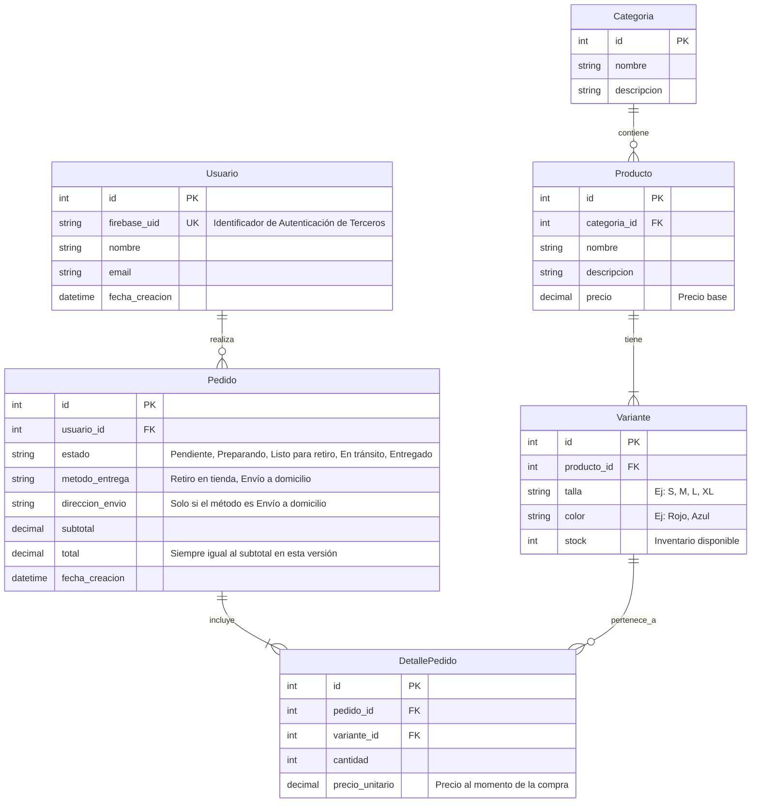

# Diseño de la Base de Datos

Basado en la Fase 2 del plan y los conceptos definidos en nuestro `CONTEXT.md`, este es el esquema relacional para la tienda de ropa. Hemos incluido la tabla `Variante` para el correcto manejo de inventario y adaptado la tabla `Usuario` para la autenticación con terceros.

## Diagrama Entidad-Relación (ERD)

## Diccionario de Datos y Reglas

### 1. `Usuario`
- **firebase_uid**: String único. Debido a que decidimos usar autenticación de terceros, no almacenamos contraseñas, sino el UID devuelto por el proveedor de autenticación.

### 2. `Categoria` y `Producto`
- Categorizan y definen el catálogo base (ej. "Camiseta de Verano" pertenece a "Hombre").

### 3. `Variante` (Control de Stock)
- Es la tabla más crítica para evitar vender productos agotados.
- Las adiciones al Carrito y la **Reserva de Inventario** ocurren verificando y descontando el campo `stock` de esta tabla.

### 4. `Pedido`
- **estado**: Sigue el flujo estricto definido en el PRD (`Pendiente` -> `Preparando` -> `Listo para retiro` / `En tránsito` -> `Entregado`). No hay estado de cancelación.
- **direccion_envio**: Puede ser Nula. Según nuestra definición en el PRD, si el método es "Retiro en tienda", este campo queda vacío. Si es "Envío a domicilio", contiene la dirección específica de esa entrega.

### 5. `DetallePedido`
- Representa lo que originalmente era el "Carrito". Una vez que se confirma la compra, se genera el `Pedido` y los ítems se guardan en esta tabla vinculados directamente a la `Variante`.
